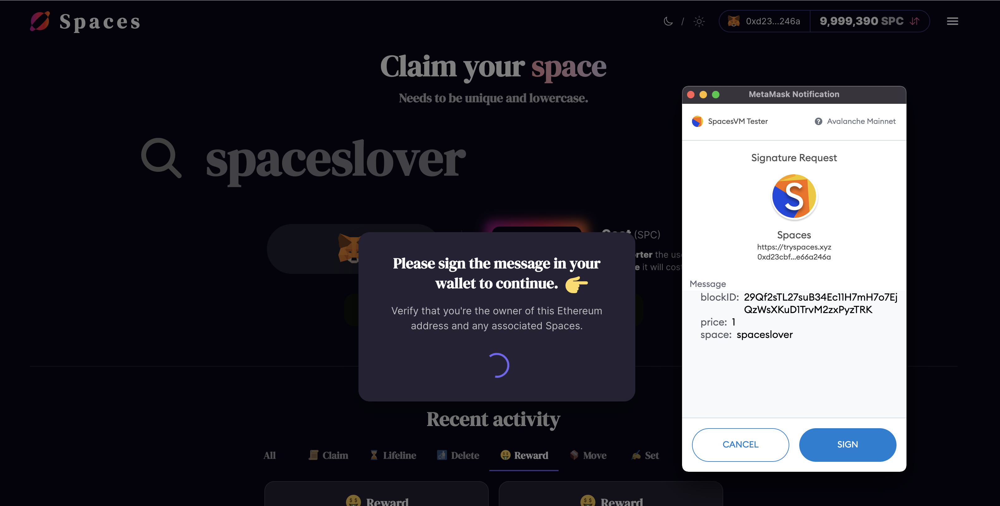

# Spaces Virtual Machine (SpacesVM)

_Authenticated, Hierarchical Key-Value Store w/EIP-712 Compatibility,
State Expiry, and Fee-Based Metering_

## Avalanche Subnets and Custom VMs
Avalanche is a network composed of multiple sub-networks (called [subnets][Subnet]) that each contain
any number of blockchains. Each blockchain is an instance of a
[Virtual Machine (VM)](https://docs.avax.network/learn/platform-overview#virtual-machines),
much like an object in an object-oriented language is an instance of a class. That is,
the VM defines the behavior of the blockchain where it is instantiated. For example,
[Coreth (EVM)][Coreth] is a VM that is instantiated by the
[C-Chain]. Likewise, one
could deploy another instance of the EVM as their own blockchain (to take
this to its logical conclusion).

## AvalancheGo Compatibility
```
[v0.0.1] AvalancheGo@v1.7.0-v1.7.4
[v0.0.2] AvalancheGo@v1.7.5-v1.7.6
[v0.0.3] AvalancheGo@v1.7.7-v1.7.9
[v0.0.4] AvalancheGo@v1.7.10
[v0.0.5] AvalancheGo@v1.7.11-v1.7.12
[v0.0.6] AvalancheGo@v1.7.13-v1.7.18
[v0.0.7] AvalancheGo@v1.7.13-v1.7.18
[v0.0.8] AvalancheGo@v1.8.0-v1.8.6
[v0.0.9] AvalancheGo@v1.9.0
```

## Introduction
Just as [Coreth] powers the [C-Chain], SpacesVM can be used to power its own
blockchain in an Avalanche [Subnet]. Instead of providing a place to execute Solidity
smart contracts, however, SpacesVM enables authenticated, hierarchical storage of arbitrary
keys/values using any [EIP-712] compatible wallet.

### Authenticated
All modifications of storage require the signature of the owner
of a "space".

### Hierarchical
Owners can modify any key in their "space" (ex: `owner/*`), however, no one
else can.

### Arbitrary Key/Value Storage
As long as a key is `^[a-z0-9]{1,256}$`, it can be used as an identifier in
SpacesVM. The max length of values is defined in genesis but typically ranges
between 64-200KB. Any number of values can be linked together to store files in
the > 100s of MBs range (as long as you have the `SPC` to pay for it).

### [EIP-712] Compatible


The canonical digest of a SpacesVM transaction is [EIP-712] compliant, so any
Web3 wallet that can sign typed data can interact with SpacesVM.

**[EIP-712] compliance in this case, however, does not mean that SpacesVM
is an EVM or even an EVM derivative.** SpacesVM is a new Avalanche-native VM written
from scratch to optimize for storage-related operations.

## Demo: [tryspaces.xyz]
What better way to understand how the the SpacesVM works than to see it in action?
Well anon, you are in luck!

You can try out the SpacesVM at [tryspaces.xyz]. All you need
is a [EIP-712] Compatible Web3 Wallet (like [MetaMask](https://metamask.io)) and some `SPC` (all 973k of
you that interacted with the [C-Chain] more than 2 times got 10k `SPC` to get you
started).

This demo is running as an Avalanche [Subnet] on Fuji. It is **ALPHA LEVEL CODE** and may be
restarted/have a few bugs in it. It exists for demonstration purposes **ONLY**
but could be extended to run as a production-level [Subnet] on Avalanche Mainnet.

## How it Works
### Claim
Interacting with the SpacesVM starts with a `ClaimTx`. This reserves your own
"space" and associates your address with it (so that only you can make changes
to it and/or the keys in it).

#### Reserved Spaces
Spaces of length 66 (`0x + hex-encoded EVM-style address`) are reserved for
address holders. Only the person who can produce a valid signature for a given
address can claim these types of spaces.

### Set/Delete
Once you have a space, you can then use `SetTx` and `DeleteTx` actions to
add/modify/delete keys in it. The more storage your space uses, the faster it
will expire.

#### Content-Addressable Keys
To support common blockchain use cases (like NFT storage), the SpacesVM
supports the storage of arbitrary size files using content-addressable keys.
You can try this out using `spaces-cli set-file <space> <filename>`.

### Lifeline
When your space uses a lot of storage and/or you've had it for a while, you may
need to extend its life using a `LifelineTx`. If you don't, your space will
eventually become inaccessible and all data stored within it will be deleted by
the SpacesVM.

#### Community Space Support
It is not required that you own a space to submit a `LifelineTx` that extends
its life. This enables the community to support useful spaces with their `SPC`.

### Resolve
When you want to view data stored in SpacesVM, you call `Resolve` on the value
path: `<space>/<key>`. If you stored a file at a particular path, use this
command to retrieve it: `spaces-cli resolve-file <path> <destination
filepath>`.

### Transfer
If you want to share some of your `SPC` with your friends, you can use
a `TransferTx` to send to any EVM-style address.

### Move
If you want to share a space with a friend, you can use a `MoveTx` to transfer
it to any EVM-style address.

### Space Rewards
50% of the fees spent on each transaction are sent to a random space owner (as
long as the randomly selected recipient is not the creator of the transaction).

One could modify the SpacesVM to instead send rewards to a beneficiary chosen by
whoever produces a block.

### Fees
All interactions with the SpacesVM require the payment of fees (denominated in
`SPC`). The VM Genesis includes support for allocating one-off `SPC` to
different EVM-style addresses and to allocating `SPC` to an airdrop list.

Nearly all fee-related params can be tuned by the SpacesVM deployer.

## Usage
_If you are interested in running the VM, not using it. Jump to [Running the
VM](#running-the-vm)._

### [tryspaces.xyz]
The easiest way to try out SpacesVM is to visit the demo website
[tryspaces.xyz].

### spaces-cli
#### Install
```bash
git clone https://github.com/ava-labs/spacesvm.git;
cd spacesvm;
go install -v ./cmd/spaces-cli;
```

#### Usage
```
SpacesVM CLI

Usage:
  spaces-cli [command]

Available Commands:
  activity     View recent activity on the network
  claim        Claims the given space
  completion   generate the autocompletion script for the specified shell
  create       Creates a new key in the default location
  delete       Deletes a key-value pair for the given space
  delete-file  Deletes all hashes reachable from root file identifier
  genesis      Creates a new genesis in the default location
  help         Help about any command
  info         Reads space info and all values at space
  lifeline     Extends the life of a given space
  move         Transfers a space to another address
  network      View information about this instance of the SpacesVM
  owned        Fetches all owned spaces for the address associated with the private key
  resolve      Reads a value at space/key
  resolve-file Reads a file at space/key and saves it to disk
  set          Writes a key-value pair for the given space
  set-file     Writes a file to the given space
  transfer     Transfers units to another address

Flags:
      --endpoint string           RPC endpoint for VM (default "https://api.tryspaces.xyz")
  -h, --help                      help for spaces-cli
      --private-key-file string   private key file path (default ".spaces-cli-pk")
      --verbose                   Print verbose information about operations

Use "spaces-cli [command] --help" for more information about a command.
```

##### Uploading Files
```
spaces-cli set-file spaceslover ~/Downloads/computer.gif -> patrick/6fe5a52f52b34fb1e07ba90bad47811c645176d0d49ef0c7a7b4b22013f676c8
spaces-cli resolve-file spaceslover/6fe5a52f52b34fb1e07ba90bad47811c645176d0d49ef0c7a7b4b22013f676c8 computer_copy.gif
spaces-cli delete-file spaceslover/6fe5a52f52b34fb1e07ba90bad47811c645176d0d49ef0c7a7b4b22013f676c8
```

### [Golang SDK](https://github.com/ava-labs/spacesvm/blob/master/client/client.go)
```golang
// Client defines spacesvm client operations.
type Client interface {
	// Pings the VM.
	Ping() (bool, error)
	// Network information about this instance of the VM
	Network() (uint32, ids.ID, ids.ID, error)

	// Returns the VM genesis.
	Genesis() (*chain.Genesis, error)
	// Accepted fetches the ID of the last accepted block.
	Accepted() (ids.ID, error)

	// Returns if a space is already claimed
	Claimed(space string) (bool, error)
	// Returns the corresponding space information.
	Info(space string) (*chain.SpaceInfo, []*chain.KeyValueMeta, error)
	// Balance returns the balance of an account
	Balance(addr common.Address) (bal uint64, err error)
	// Resolve returns the value associated with a path
	Resolve(path string) (exists bool, value []byte, valueMeta *chain.ValueMeta, err error)

	// Requests the suggested price and cost from VM.
	SuggestedRawFee() (uint64, uint64, error)
	// Issues the transaction and returns the transaction ID.
	IssueRawTx(d []byte) (ids.ID, error)

	// Requests the suggested price and cost from VM, returns the input as
	// TypedData.
	SuggestedFee(i *chain.Input) (*tdata.TypedData, uint64, error)
	// Issues a human-readable transaction and returns the transaction ID.
	IssueTx(td *tdata.TypedData, sig []byte) (ids.ID, error)

	// Checks the status of the transaction, and returns "true" if confirmed.
	HasTx(id ids.ID) (bool, error)
	// Polls the transactions until its status is confirmed.
	PollTx(ctx context.Context, txID ids.ID) (confirmed bool, err error)

	// Recent actions on the network (sorted from recent to oldest)
	RecentActivity() ([]*chain.Activity, error)
	// All spaces owned by a given address
	Owned(owner common.Address) ([]string, error)
}
```

### Public Endpoints (`/public`)

#### spacesvm.ping
```
<<< POST
{
  "jsonrpc": "2.0",
  "method": "spacesvm.ping",
  "params":{},
  "id": 1
}
>>> {"success":<bool>}
```

#### spacesvm.network
```
<<< POST
{
  "jsonrpc": "2.0",
  "method": "spacesvm.network",
  "params":{},
  "id": 1
}
>>> {"networkId":<uint32>, "subnetId":<ID>, "chainId":<ID>}
```

#### spacesvm.genesis
```
<<< POST
{
  "jsonrpc": "2.0",
  "method": "spacesvm.genesis",
  "params":{},
  "id": 1
}
>>> {"genesis":<genesis file>}
```

#### spacesvm.suggestedFee
_Provide your intent and get back a transaction to sign._
```
<<< POST
{
  "jsonrpc": "2.0",
  "method": "spacesvm.suggestedFee",
  "params":{
    "input":<chain.Input (tx abstractor)>
  },
  "id": 1
}
>>> {"typedData":<EIP-712 compliant typed data for signing>,
>>> "totalCost":<uint64>}
```

##### chain.Input
```
{
  "type":<string>,
  "space":<string>,
  "key":<string>,
  "value":<base64 encoded>,
  "to":<hex encoded>,
  "units":<uint64>
}
```

###### Transaction Types
```
claim    {type,space}
lifeline {type,space,units}
set      {type,space,key,value}
delete   {type,space,key}
move     {type,space,to}
transfer {type,to,units}

```

#### spacesvm.issueTx
```
<<< POST
{
  "jsonrpc": "2.0",
  "method": "spacesvm.issueTx",
  "params":{
    "typedData":<EIP-712 compliant typed data>,
    "signature":<hex-encoded sig>
  },
  "id": 1
}
>>> {"txId":<ID>}
```

##### Transaction Creation Worflow
```
1) spacesvm.claimed {"space":"patrick"} => Yes/No
2) spacesvm.suggestedFee {"input":{"type":"claim", "space":"patrick"}} => {"typedData":<EIP-712 Typed Data>, "cost":<total fee>}
3) sign EIP-712 Typed Data
4) spacesvm.issueTx {"typedData":<from spacesvm.suggestedFee>, "signature":<sig from step 3>} => {"txId":<ID>}
5) [loop] spacesvm.hasTx {"txId":<ID>} => {"accepted":true"}
```

#### spacesvm.hasTx
```
<<< POST
{
  "jsonrpc": "2.0",
  "method": "spacesvm.hasTx",
  "params":{
    "txId":<transaction ID>
  },
  "id": 1
}
>>> {"accepted":<bool>}
```

#### spacesvm.lastAccepted
```
<<< POST
{
  "jsonrpc": "2.0",
  "method": "spacesvm.lastAccepted",
  "params":{},
  "id": 1
}
>>> {"height":<uint64>, "blockId":<ID>}
```

#### spacesvm.claimed
```
<<< POST
{
  "jsonrpc": "2.0",
  "method": "spacesvm.claimed",
  "params":{
    "space":<string>
  },
  "id": 1
}
>>> {"claimed":<bool>}
```

#### spacesvm.info
```
<<< POST
{
  "jsonrpc": "2.0",
  "method": "spacesvm.info",
  "params":{
    "space":<string>
  },
  "id": 1
}
>>> {"info":<chain.SpaceInfo>, "values":[<chain.KeyValueMeta>]}
```

##### chain.SpaceInfo
```
{
  "owner":<hex encoded>,
  "created":<unix>,
  "updated":<unix>,
  "expiry":<unix>,
  "units":<uint64>,
  "rawSpace":<ShortID>
}
```

##### chain.KeyValueMeta
```
{
  "key":<string>,
  "valueMeta":{
    "created":<unix>,
    "updated":<unix>,
    "txId":<ID>, // where value was last set
    "size":<uint64>
  }
}
```

#### spacesvm.resolve
```
<<< POST
{
  "jsonrpc": "2.0",
  "method": "spacesvm.resolve",
  "params":{
    "path":<string | ex:jim/twitter>
  },
  "id": 1
}
>>> {"exists":<bool>, "value":<base64 encoded>, "valueMeta":<chain.ValueMeta>}
```

#### spacesvm.balance
```
<<< POST
{
  "jsonrpc": "2.0",
  "method": "spacesvm.balance",
  "params":{
    "address":<hex encoded>
  },
  "id": 1
}
>>> {"balance":<uint64>}
```

#### spacesvm.recentActivity
```
<<< POST
{
  "jsonrpc": "2.0",
  "method": "spacesvm.recentActivity",
  "params":{},
  "id": 1
}
>>> {"activity":[<chain.Activity>,...]}
```

##### chain.Activity
```
{
  "timestamp":<unix>,
  "sender":<address>,
  "txId":<ID>,
  "type":<string>,
  "space":<string>,
  "key":<string>,
  "to":<hex encoded>,
  "units":<uint64>
}
```

###### Activity Types
```
claim    {timestamp,sender,txId,type,space}
lifeline {timestamp,sender,txId,type,space,units}
set      {timestamp,sender,txId,type,space,key,value}
delete   {timestamp,sender,txId,type,space,key}
move     {timestamp,sender,txId,type,space,to}
transfer {timestamp,sender,txId,type,to,units}
reward   {timestamp,txId,type,to,units}
```

#### spacesvm.owned
```
<<< POST
{
  "jsonrpc": "2.0",
  "method": "spacesvm.owned",
  "params":{
    "address":<hex encoded>
  },
  "id": 1
}
>>> {"spaces":[<string>]}
```

### Advanced Public Endpoints (`/public`)

#### spacesvm.suggestedRawFee
_Can use this to get the current fee rate._
```
<<< POST
{
  "jsonrpc": "2.0",
  "method": "spacesvm.suggestedRawFee",
  "params":{},
  "id": 1
}
>>> {"price":<uint64>,"cost":<uint64>}
```

#### spacesvm.issueRawTx
```
<<< POST
{
  "jsonrpc": "2.0",
  "method": "spacesvm.issueRawTx",
  "params":{
    "tx":<raw tx bytes>
  },
  "id": 1
}
>>> {"txId":<ID>}
```

## Running the VM
To build the VM (and `spaces-cli`), run `./scripts/build.sh`.

### Joining the Spaces Demo
If you'd like to validate the [Spaces Subnet Demo] on Fuji, please follow the following
steps: 

_You can find the genesis used for the Spaces Demo in `networks/42/*`._

#### Download and Build SpacesVM
```bash
git clone https://github.com/ava-labs/spacesvm.git;
cd spacesvm;
./scripts/build.sh
```

Running the above commands will generate a binary and save it at
`~/spacesvm/build/sqja3uK17MJxfC7AN8nGadBw9JK5BcrsNwNynsqP5Gih8M5Bm`.

#### Move Binary
Once the SpacesVM binary is built, you'll need to move it to AvalancheGo's
plugin directory (within the `--build-dir`) so it can be run by your node.
When building from source, this defaults to `~/avalanchego/build/plugins`.
This build directory is structured as:
```
build-dir
|_avalanchego
    |_plugins
      |_evm
```

To put the SpacesVM binary in the right place, run the following command
(assuming the `avalanchego` and `spacesvm` repos are in the same folder):
```bash
mv ./spacesvm/build/sqja3uK17MJxfC7AN8nGadBw9JK5BcrsNwNynsqP5Gih8M5Bm ./avalanchego/build/plugins;
```

#### Add Subnet to Whitelist
Next, you'll need to provide the `whitelisted-subnets` argument by
modifying your config file or providing an argument on
startup (which tells your node to connect to the Spaces Subnet Demo). 
[Ai42MkKqk8yjXFCpoHXw7rdTWSHiKEMqh5h8gbxwjgkCUfkrk](https://testnet.avascan.info/blockchains?subnet=Ai42MkKqk8yjXFCpoHXw7rdTWSHiKEMqh5h8gbxwjgkCUfkrk) 
is the subnet id for Spaces Subnet.

Example Config File:
```json
{
  "network-id":"fuji",
  "health-check-frequency":"2s",
  "log-display-level":"INFO",
  "log-level":"INFO",
  "whitelisted-subnets":"Ai42MkKqk8yjXFCpoHXw7rdTWSHiKEMqh5h8gbxwjgkCUfkrk"
}
```

Example Node Args:
```bash
--whitelisted-subnets=Ai42MkKqk8yjXFCpoHXw7rdTWSHiKEMqh5h8gbxwjgkCUfkrk --network-id=fuji
```

#### Restart Node
Once you've performed the following steps, you'll need to restart your
AvalancheGo node for the changes to take effect.

If you completed the steps successfully, you'll see the node print out:
```bash
INFO [01-25|16:47:04] chains/manager.go#246: creating chain:
    ID: 2AM3vsuLoJdGBGqX2ibE8RGEq4Lg7g4bot6BT1Z7B9dH5corUD
    VMID:sqja3uK17MJxfC7AN8nGadBw9JK5BcrsNwNynsqP5Gih8M5Bm
INFO [01-25|16:47:04] api/server/server.go#203: adding route /ext/bc/2JVSBoinj9C2J33VntvzYtVJNZdN2NKiwwKjcumHUWEb5DbBrm/events
INFO [01-25|16:47:04] api/server/server.go#203: adding route /ext/bc/2JVSBoinj9C2J33VntvzYtVJNZdN2NKiwwKjcumHUWEb5DbBrm
INFO [01-25|16:47:04] api/server/server.go#203: adding route /ext/bc/2JVSBoinj9C2J33VntvzYtVJNZdN2NKiwwKjcumHUWEb5DbBrm/wallet
INFO [01-25|16:47:04] <2AM3vsuLoJdGBGqX2ibE8RGEq4Lg7g4bot6BT1Z7B9dH5corUD Chain> snow/engine/snowman/transitive.go#67: initializing consensus engine
INFO [01-25|16:47:04] <2AM3vsuLoJdGBGqX2ibE8RGEq4Lg7g4bot6BT1Z7B9dH5corUD Chain> snow/engine/snowman/bootstrap/bootstrapper.go#225: Starting bootstrap...
INFO [01-25|16:47:04] <P Chain> snow/engine/snowman/bootstrap/bootstrapper.go#458: waiting for the remaining chains in this subnet to finish syncing
INFO [01-25|16:47:04] api/server/server.go#203: adding route /ext/bc/2AM3vsuLoJdGBGqX2ibE8RGEq4Lg7g4bot6BT1Z7B9dH5corUD/public
INFO [01-25|16:47:04] <2AM3vsuLoJdGBGqX2ibE8RGEq4Lg7g4bot6BT1Z7B9dH5corUD Chain> snow/engine/common/bootstrapper.go#235: Bootstrapping started syncing with 2 vertices in the accepted frontier
INFO [01-25|16:47:05] <2AM3vsuLoJdGBGqX2ibE8RGEq4Lg7g4bot6BT1Z7B9dH5corUD Chain> snow/engine/snowman/bootstrap/bootstrapper.go#419: bootstrapping fetched 69 blocks. Executing state transitions...
INFO [01-25|16:47:06] <2AM3vsuLoJdGBGqX2ibE8RGEq4Lg7g4bot6BT1Z7B9dH5corUD Chain> snow/engine/common/queue/jobs.go#181: executed 69 operations
INFO [01-25|16:47:06] <2AM3vsuLoJdGBGqX2ibE8RGEq4Lg7g4bot6BT1Z7B9dH5corUD Chain> snow/engine/snowman/transitive.go#354: bootstrapping finished with 2DUxceCx71L5TLTeLpKUQxSBVm8vTKPmFs2usAyRnusUzs4Q4M as the last accepted block
```

If you didn't put the SpacesVM binary in the right place, you'll see something
like:
```bash
INFO [01-26|05:54:19] chains/manager.go#246: creating chain:
    ID: 2AM3vsuLoJdGBGqX2ibE8RGEq4Lg7g4bot6BT1Z7B9dH5corUD
    VMID:sqja3uK17MJxfC7AN8nGadBw9JK5BcrsNwNynsqP5Gih8M5Bm
ERROR[01-26|05:54:19] chains/manager.go#270: error creating chain 2AM3vsuLoJdGBGqX2ibE8RGEq4Lg7g4bot6BT1Z7B9dH5corUD: error while looking up VM: there is no ID with alias sqja3uK17MJxfC7AN8nGadBw9JK5BcrsNwNynsqP5Gih8M5Bm
```

#### Become a Fuji Validator
Once your node is up and running with the SpacesVM, you'll need to [become a Fuji Validator].
This is the exact same flow as Mainnet except you only need to stake
`1 AVAX` instead of `2000 AVAX`.

Recall, **only validators on the Primary Network (in this case Fuji) can become
validators of subnets.**

#### Submit a Validator Request
Once you've completed the above steps and your node is fully bootstrapped, submit a
[Spaces Demo Validator Request] to be considered as a validator (everyone will
be approved).

The Spaces Subnet Demo is a Permissioned Subnet and requires explicit approval from the
creator to validate. In the near future, it will be possible to create permissionless
subnets that anyone can join.

If you have any questions, reach out to @\_patrickogrady on Twitter!

### Running a local network
[`scripts/run.sh`](scripts/run.sh) automatically installs [avalanchego], sets up a local network,
and creates a `spacesvm` genesis file. To build and run E2E tests, you need to set the variable `E2E` before it: `E2E=true ./scripts/run.sh 1.7.11`

_See [`tests/e2e`](tests/e2e) to see how it's set up and how its client requests are made._

```bash
# to startup a local cluster (good for development)
cd ${HOME}/go/src/github.com/ava-labs/spacesvm
./scripts/run.sh 1.7.11

# to run full e2e tests and shut down cluster afterwards
cd ${HOME}/go/src/github.com/ava-labs/spacesvm
E2E=true ./scripts/run.sh 1.7.11
```

```bash
# inspect cluster endpoints when ready
cat /tmp/avalanchego-v1.7.11/output.yaml
<<COMMENT
endpoint: /ext/bc/2VCAhX6vE3UnXC6s1CBPE6jJ4c4cHWMfPgCptuWS59pQ9vbeLM
logsDir: ...
pid: 12811
uris:
- http://localhost:56239
- http://localhost:56251
- http://localhost:56253
- http://localhost:56255
- http://localhost:56257
COMMENT

# ping the local cluster
curl --location --request POST 'http://localhost:61858/ext/bc/BJfusM2TpHCEfmt5i7qeE1MwVCbw5jU1TcZNz8MYUwG1PGYRL/public' \
--header 'Content-Type: application/json' \
--data-raw '{
    "jsonrpc": "2.0",
    "method": "spacesvm.ping",
    "params":{},
    "id": 1
}'
<<COMMENT
{"jsonrpc":"2.0","result":{"success":true},"id":1}
COMMENT

# resolve a path
curl --location --request POST 'http://localhost:61858/ext/bc/BJfusM2TpHCEfmt5i7qeE1MwVCbw5jU1TcZNz8MYUwG1PGYRL/public' \
--header 'Content-Type: application/json' \
--data-raw '{
    "jsonrpc": "2.0",
    "method": "spacesvm.resolve",
    "params":{
      "path": "coolperson/twitter"
    },
    "id": 1
}'
<<COMMENT
{"jsonrpc":"2.0","result":{"exists":true, "value":"....", "valueMeta":{....}},"id":1}
COMMENT

# to terminate the cluster
kill 12811
```

### Deploying Your Own Network
Anyone can deploy their own instance of the SpacesVM as a subnet on Avalanche.
All you need to do is compile it, create a genesis, and send a few txs to the
P-Chain.

You can do this by following the [subnet tutorial]
or by using the [subnet-cli].

[EIP-712]: https://eips.ethereum.org/EIPS/eip-712
[tryspaces.xyz]: https://tryspaces.xyz
[avalanchego]: https://github.com/ava-labs/avalanchego
[subnet tutorial]: https://docs.avax.network/build/tutorials/platform/subnets/create-a-subnet
[subnet-cli]: https://github.com/ava-labs/subnet-cli
[Coreth]: https://github.com/ava-labs/coreth
[C-Chain]: https://docs.avax.network/learn/platform-overview/#contract-chain-c-chain
[Subnet]: https://docs.avax.network/learn/platform-overview/#subnets
[Spaces Subnet Demo]: https://tryspaces.xyz
[Spaces Demo Validator Request]: https://forms.gle/aDFWBLEP9GvHwaFG6
[become a Fuji Validator]: https://docs.avax.network/build/tutorials/nodes-and-staking/staking-avax-by-validating-or-delegating-with-the-avalanche-wallet
